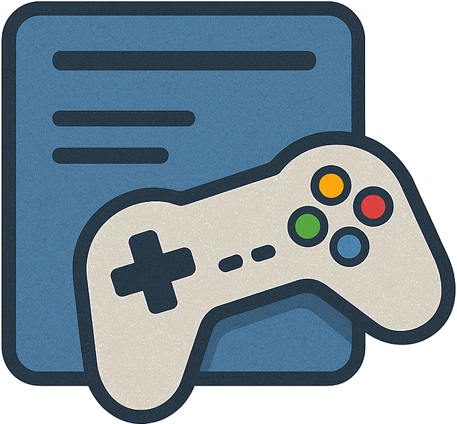

Game Librarian ((1.0) 160926 - Pre)
==============

<div align="center">



Open‑source, unified game library for Windows — discover, launch, and track playtime across multiple launchers with a beautiful, modern UI.

</div>

Features
--------

- Unified library: Steam, Epic, Ubisoft, GOG, Xbox (MS Store) + Roblox
- Playtime & sessions: one‑click play, live session overlay, recent games row
- Polished UI: grid/list/small card views, A→Z and playtime sorting, search
- Theming: Dark/Light + vivid presets (Neon Blue/Red/Green, Orange Sunrise, Purple Galaxy, Sea Breeze)
- Smart updater: reads `Version.Json` locally and from GitHub (`(1.0) 160926 - Pre`)
- High‑res artwork: Steam header images as fallback for Epic/Ubisoft where available
- In‑app Debug Console: live logs, clear buffer, export bundle to `Logs/` *WIP

Install
-------

- Download the latest release and run the installer (`installer/Installer.exe`).
- The app checks for updates on launch.
- To uninstall, use `installer/Uninstaller.exe` (or Windows Apps & Features).

Building the installer (Python 3.10+, Pillow, PyInstaller):

```powershell
powershell -ExecutionPolicy Bypass -File installer/src/build_installers.ps1
```

Sources live in `installer/src/` (gitignored: `installer_gui.pyw`, `uninstaller_gui.pyw`, shared `gl_ui.py`, `Librarian_launcher.pyw`); the script rebuilds both executables into `installer/`. Add `-Launcher` to also rebuild `Librarian_Launcher.exe`.

Quick Start (Dev)
-----------------

Prereqs: Node 18+, npm, Git

```bash
git clone https://github.com/Maxibon13/Game-Librarian.git
cd Game-Librarian
npm install
npm run dev
```

This starts Vite and Electron together. The main process lives in `electron/`, and the renderer is powered by React + Vite in `src/renderer/`.

Project Structure
-----------------

```
GameLibrarian/
  electron/              # main process (window, IPC, Windows shell integration)
  src/
    main/                # node/electron services (detection, playtime, settings)
    renderer/            # React UI (views, components, lib, nav)
    types/
  assets/
    icons/               # app + installer icons
    sounds/              # UI SFX
  tools/                 # runtime helpers shipped with the app (python detectors, proc.py, updater.bat)
  installer/             # Installer.exe / Uninstaller.exe (shipped)
    src/                 # installer sources + build script (gitignored, local only)
  dev/                   # scratch scripts and notes (gitignored, local only)
  Librarian_Launcher.exe # entry point: runs dist/win-unpacked or `npm run dev`
  Version.Json           # App version string, compared against GitHub main
```

Detectors
---------

- Steam: libraries & manifests (with image cache/CDN fallbacks)
- Epic: EGS manifests in ProgramData; launch via protocol (Windows)
- Ubisoft: registry + default folders, Steam header image fallback
- GOG: registry + custom libraries
- Xbox (MS Store): registry + StartApps AUMID mapping; launched via AppsFolder
- Roblox: protocol/launcher detection

Theming
-------

Switch themes from the header dropdown. Light/Dark plus vivid presets with subtle gradients. Custom themes were previously supported; presets are now streamlined and consistent.

Build / Package
-----

```bash
npm run dist:Dir    # Produce distributable folder
```

Artifacts are created via electron‑builder. See `package.json` → `build` for config.

Changelog
---------

See CHANGELOG.md. You can also open it from within the app (header → Changelog).

Contributing
------------

Issues and PRs are welcome! For larger changes, open an issue first to discuss direction. Please keep code readable and align with the existing style guidelines.

License
-------

MIT © Game Librarian contributors


